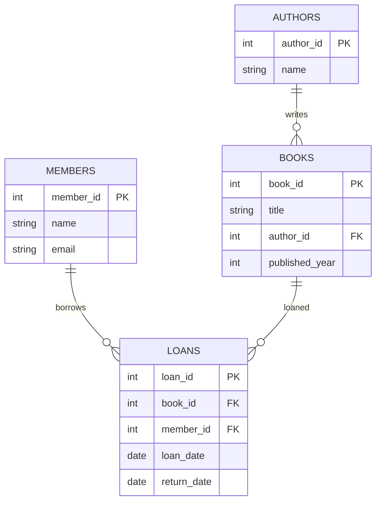

# Assignment 8 - DBMS Project

## Question 1: Library Management System

Built with MySQL
Includes relationships: 1-M (Authors to Books), M-M (Books to Members via Loans)

## Question 2: Contact Book API

- FastAPI + MySQL
- Simple CRUD for managing contacts

## How to Run

1. Import the SQL scripts in a MySQL database.
2. Install FastAPI dependencies and run the app:

```bash
pip install fastapi uvicorn mysql-connector-python
uvicorn main:app --reload
```
## Entity Relationship Diagram (Library Management System)


